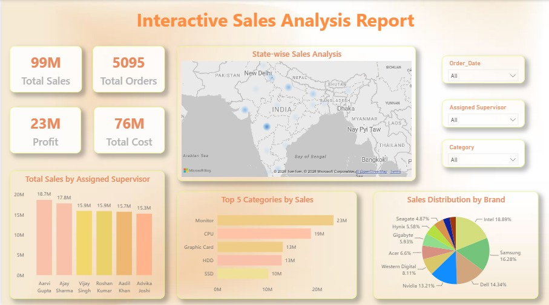

# Techno Sales Performance Dashboard

## Project Overview
This project presents an interactive Power BI dashboard to analyze techno sales performance and generate business insights.

## Dashboard Features
- KPI Cards (Total Sales, Total Orders, Profit, Total Cost)
- Top 5 Categories by Sales
- Sales Distribution by Brand
- State-wise Sales Analysis
- Sales by Assigned Supervisor
- Interactive Slicers

## Tools Used
- Power BI Desktop
- Power Query
- DAX

## Key Insights
- Monitor category generated the highest sales.
- Intel and Samsung contributed significantly to overall sales.
- Sales performance varies across different states.
- Supervisors showed different sales performances.

## Dashboard Preview

## Files Included
- `.pbix` file
- Dashboard screenshot
- Dataset (optional)
